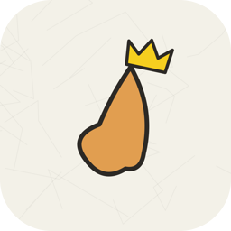
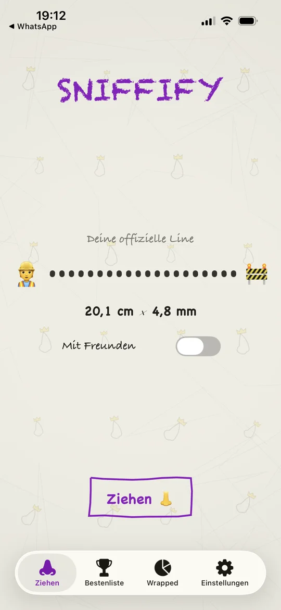
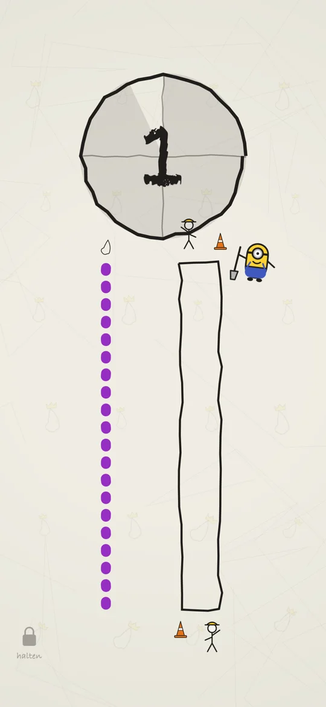
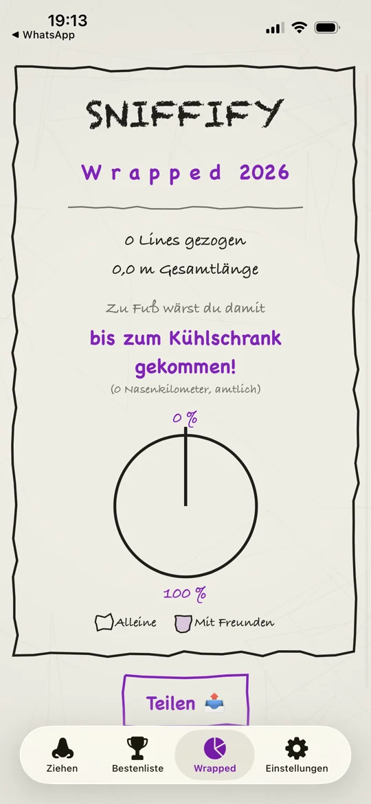
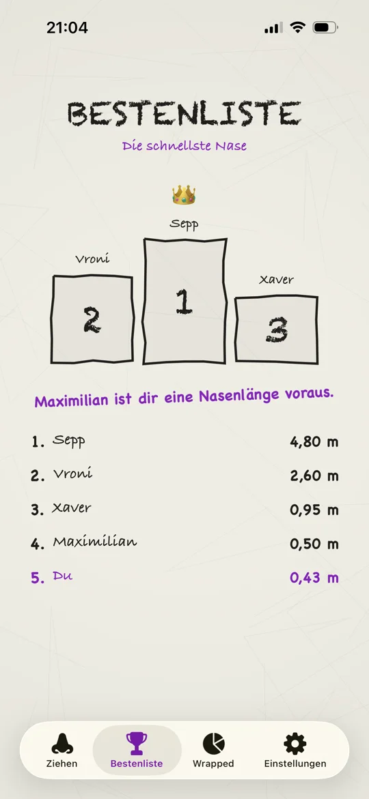
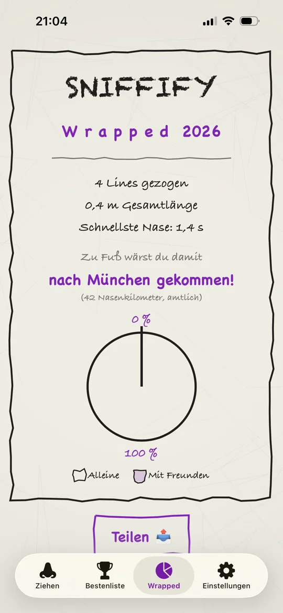

  
  <h1>Sniffify 👃👑</h1>

> „Maximilian ist dir eine Nasenlänge voraus."

A **satirical iOS gag app** — built as a joke gift for a friend who
enjoys snuff tobacco (Schnupftabak). It recreates, feature for feature, the
fictional app pitched in a German stand-up bit: enter your body data, get your
"official" line, sniff it off the screen at zero, get praised by a flying
crowned nose, lose to Maximilian forever, and receive a Spotify-Wrapped-style
year recap of your Nasenkilometer.

**Credit / inspiration:** the original sketch —
<https://www.instagram.com/p/DbBXNMXi5J2/> — go watch it, the comedian's
hand-drawn mockups are this app's entire design spec. (His material is
deliberately not mirrored in this repo; it's his, not ours.)

**This app is satire.** Adults only, never distributed on any store, and it
works exclusively with legal snuff tobacco. Don't be weird about it.

## Preview

  
  
  
  
  

Demo video (muted, 1.2×): [MP4](assets/demo.mp4) · [WebM](assets/demo.webm)
*(all preview media downscaled and metadata-stripped)*

## The Gag, End to End

1. **Onboarding** — 18+ satire splash (with the rejected „Schneekönig" icon
   gag), then height + weight: science needs data, your line is personal.
2. **Ziehen** — the tobacco goes into a hand-drawn box rendered at **true
   physical size** (points-per-cm), marked out like a construction site.
   Film-style countdown 3→0, then the challenge: pull through your tube —
   the **mic hears the pull** (a tube is invisible to a touchscreen) and
   the purple track beside the box empties as you go, until the line is
   **completely gone**. A botched pull doesn't fail; the stopwatch just runs
   and you pull again — but the result comes with an amtliche Schulnote:
   one pull within 1.5 s of zero is a 1 („PERFEKT!"), every extra attempt
   and every bit of dawdling costs a grade. Silence gets a „Wir hören nix —
   kräftiger ziehen!". The little shoveler follows your pull
   the whole way and sweeps up on success — „Du bist spitze!". Screen stays
   awake, rotation is locked, system edges are deferred; the only exits are
   finishing, giving up for 45 s, or holding the little lock. The acoustic
   analysis even guesses Röhrchen vs. Direktzug.
3. **Bestenliste** — podium of „Die schnellste Nase", ranked by
   Notendurchschnitt (a failed line counts as a 6). Maximilian is pinned
   exactly one Nasenlänge (7 cm) and a tenth of a grade ahead of you — a
   0,9 if he has to. Forever. That's the joke.
4. **Wrapped** — year totals converted at the official rate of
   1 cm Line = 1 km Fußweg, with a destination ladder ending in Peru, an
   Alleine/Mit-Freunden doodle pie, and share-as-image.
5. **Einstellungen** — profile, data reset, satire small print, and a
   **Debug** section that records the detection window as `.caf` files
   (Files-app accessible) for calibrating the sniff detection.

## Design Language

Everything mimics the sketch's overlays: crumpled-paper background with
procedural creases, wobbly seeded-jitter shapes, iOS built-in handwriting
fonts (Chalkduster / Chalkboard / Bradley Hand), doodle noses everywhere.
Pure SwiftUI — **zero external dependencies**.

## Requirements & Building

- Xcode 26+, iOS 26.0+ deployment target, Swift 6 toolchain
- `just build` (simulator), `just check` (format + build), `just open`
- Mic permission is requested at first „Ziehen"; denial degrades gracefully
  to touch-only judging.

## Calibration Knobs

Real hardware varies — these constants are meant to be tuned with recordings
from Settings → Debug:

| Knob | Where |
|------|-------|
| Pull threshold / absolute gate / min duration | `Core/Audio/SniffDetector.swift` (replay captures: `just replay <files>`) |
| Pulling seconds per cm of line | `Shared/Sniffonomics.swift` |
| Tube-vs-direct ZCR threshold | `Features/Sniff/SniffSessionViewModel.swift` |
| Coverage %, nose radius, window | `Features/Sniff/SniffSessionViewModel.swift` |
| Points-per-cm (true line size) | `Shared/Sniffonomics.swift` |

## Documentation

- [ARCHITECTURE.md](ARCHITECTURE.md) — layers, data flow, patterns
- [CLAUDE.md](CLAUDE.md) — AI assistant guidance

## License

[CC BY-NC-SA 4.0](LICENSE) — share it, tinker with it, remix it, but:

- **Attribution**: credit by linking back to this repository.
- **NonCommercial**: no selling, no commercial use, in any form.
- **ShareAlike**: anything built on it carries these same terms — it stays
  free, forever.

The original comedy sketch this app is based on belongs to its creator —
credit and source: <https://www.instagram.com/p/DbBXNMXi5J2/>.
